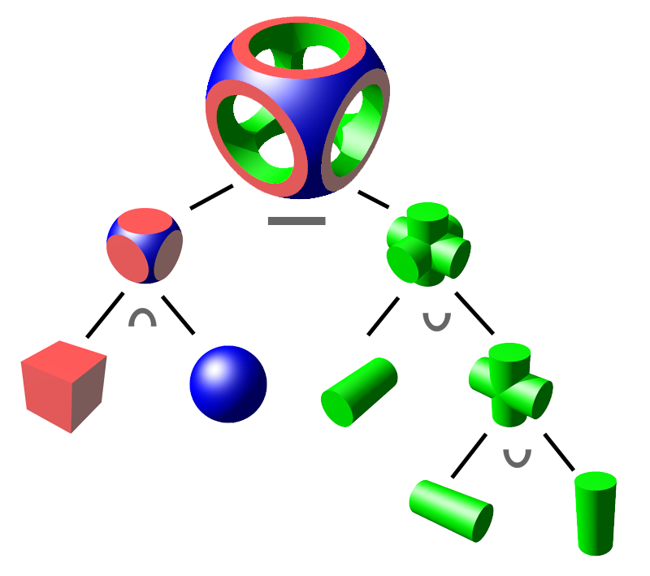

<!--
footer: Repositório desta apresentação https://github.com/andreyev/i3d_para_as_massas
-->


# **Impressão 3D para as massas**

## Transformando ideias em realidade

---
<!--
header: Impressão 3D para as massas
footer: Repositório desta apresentação https://github.com/andreyev/i3d_para_as_massas
-->

_Disclaimer_ :
- Uma GIA(ChatGPT-4) foi usada para confecção desta apresentação.
- As opiniões expressas neste documento são de responsabilidade exclusiva do autor e não refletem necessariamente as opiniões ou posições de quaisquer organizações, instituições ou entidades com as quais o autor esteja associado. As informações e visões apresentadas são de caráter pessoal e não devem ser interpretadas como uma representação oficial ou endosse de quaisquer organizações ou partes externas.

---

_Disclaimer_ #2:
> _TIMTOWTDI_

---

_Disclaimer_ #2:
> _There Is More Than One Way To Do It_ (tem mais de um jeito de fazer isso) ;-)

---

> "A impressão 3D é uma solução a procura de problemas"

---

> "A impressão 3D é uma solução a procura de problemas VELHOS"

---


<!--
footer: 'fonte da imagem: https://autodesk-fusion-360.en.lo4d.com/screenshots'
-->

---


<!--
footer: 'fonte da imagem: https://hopific.com/introduction-to-grasshopper-for-rhino/'
-->

---

# Vantagens:
* Parametrizável
* Versionavel
* Automação
* Gestão do ciclo de vida
* _CAD_(_Computer-Aided Design_)/_CAM_(_Computer-Aided Manufacturing_)
* _Over Engineering_?!

---

> _Keep It Simple_ (Mantenha a simplicidade)

---


<!--
footer: 'fonte da imagem: https://www.bumerangbrinquedos.com.br/blocos-de-encaixar-maletuxo-didatico-com-formas-geometricas-vermelho-toys-cardoso-3035/p'
-->

---


<!--
footer: 'fonte da imagem: https://brasilescola.uol.com.br/o-que-e/matematica/o-que-sao-poliedros-platao.htm'
-->

---

# CSG > CAD

---

## _Constructive Solid Geometry_ (Geometria Sólida Construtiva)

* União
* Interseção
* Subtração

---


<!--
footer: 'fonte da imagem: https://en.wikipedia.org/wiki/Constructive_solid_geometry'
-->

---

<!--
header: Impressão 3D para as massas
footer: Repositório desta apresentação https://github.com/andreyev/i3d_para_as_massas
-->

# Demo

https://www.tinkercad.com/dashboard

---

```
; Início do G-code
G21 ; Define as unidades como milímetros
G90 ; Define o modo de posicionamento absoluto
M104 S200 ; Define a temperatura do bico para 200°C (ajuste conforme necessário)
M140 S60 ; Define a temperatura da mesa para 60°C
G28 ; Home em todos os eixos
G92 E0 ; Zera o extrusor

; Espera a temperatura estabilizar
M109 S200 ; Aguarda o bico atingir 200°C
M190 S60 ; Aguarda a mesa atingir 60°C

; Move o bico para a posição inicial
G1 Z0.2 F300 ; Levanta ligeiramente o bico

; Desenha a primeira camada do cubo (10mm x 10mm)
G1 X0 Y0 F1500 ; Move para a origem
G1 Z0.2 F300 ; Define a altura inicial da camada
G1 X10 Y0 E1 F1500 ; Extrusão na borda inferior
G1 X10 Y10 E2 ; Lado direito
G1 X0 Y10 E3 ; Lado superior
G1 X0 Y0 E4 ; Lado esquerdo (fecha o quadrado)
...
```

---

# Agradecimentos

* [Sheimy](https://www.linkedin.com/in/sheimyrahman/)
* [JRGandara](https://www.linkedin.com/in/joao-roberto-sampaio-gandara-ferreira-95905a155/)

---

# Extras

- AI https://text-to-cad.zoo.dev/dashboard
- paquimetro

---

<!--
footer: ''
-->

# Obrigado!!!!!1
Repositório desta apresentação https://github.com/andreyev/i3d_para_as_massas

